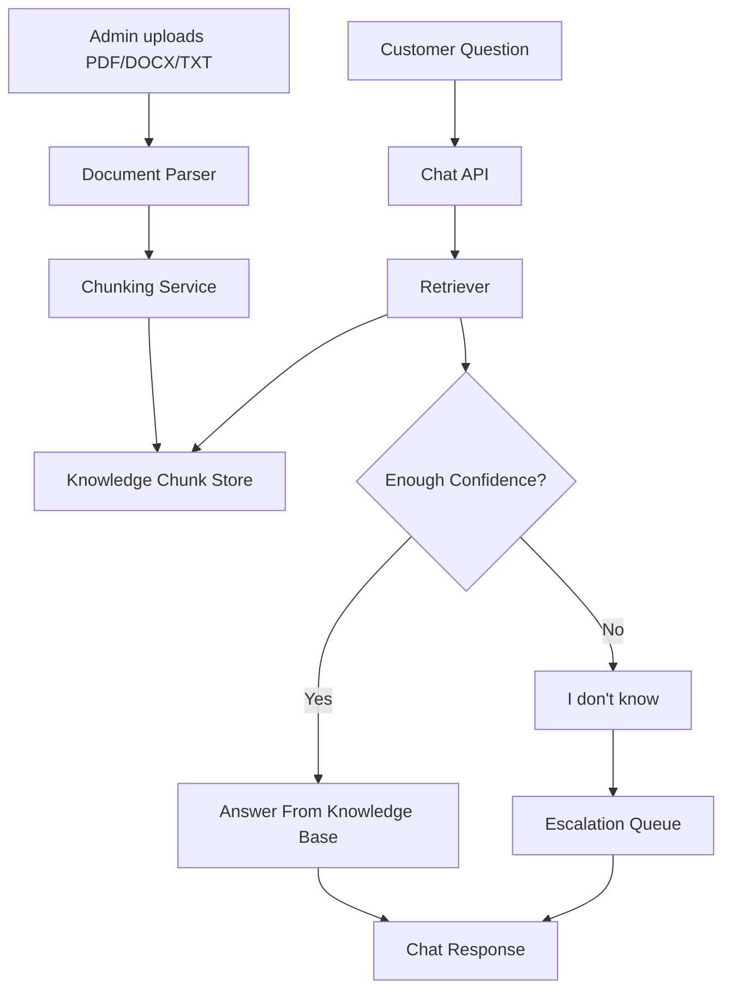

# Architecture

```mermaid
flowchart TD
    A["Admin uploads PDF/DOCX/TXT"] --> B["Document Parser"]
    B --> C["Chunking Service"]
    C --> D["Knowledge Chunk Store"]
    E["Customer Question"] --> F["Chat API"]
    F --> G["Retriever"]
    G --> D
    G --> H{"Enough Confidence?"}
    H -->|"Yes"| I["Answer From Knowledge Base"]
    H -->|"No"| J["I don't know"]
    J --> K["Escalation Queue"]
    I --> L["Chat Response"]
    K --> L
```

